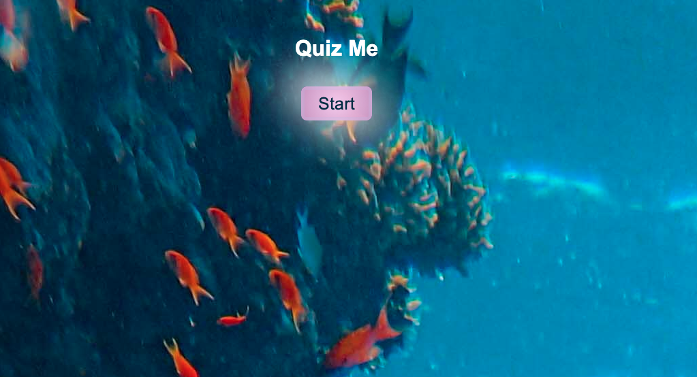
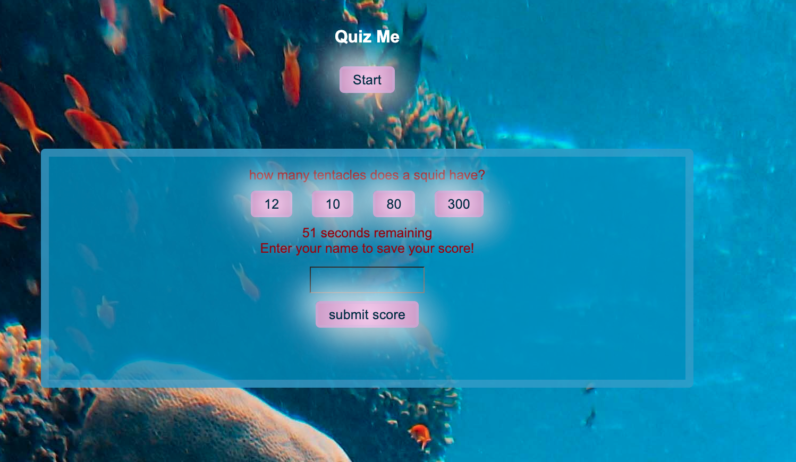
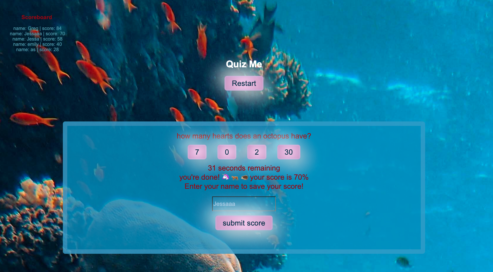

# Coding-Quiz
This is a quiz designed to help new developers test their javascript skills, it is using browser API's, htmls, css, javascript

## Table of Contents

**[Quick Links](#Quick-Links)** 
**[First Looks](#First-Looks)** 
**[Wireframes](#Wireframes)** 
**[Bugs and Known Issues](#Bugs-and-Known-Issues)** 
**[Next Steps to Continue](#Next-Steps-to-Continue)** 
**[Wireframes OR SudoCode of Acceptance Criteria](Wireframes-OR-SudoCode-of-Acceptance-Criteria)** 
**[Acceptance Criteria](#Acceptance-Criteria)** 
**[Bonus](#Bonus)** 
**[Deliverables](#Deliverables)** 
**[License](#License)** 

## Quick Links

- click here to view --> [final website](https://jessamyn27.github.io/Coding-Quiz/)

- click here to view --> [README GUIDE from UT](https://github.com/the-Coding-Boot-Camp-at-UT/UTA-VIRT-FSF-FT-06-2021-U-LOL/blob/master/01-HTML-Git-CSS/02-Homework/Homework-Guide/README.md)

## First Looks

# 

# 

# 

## Wireframes OR SudoCod

## Bugs and Known Issues

- reset function is just a page refresh, could use a better clear of other functionality

## Next Steps to Continue

### Next Steps for App UI and Functionality

- hover and click IU needs work
- font color and sizing needs improvement
- animation?
- padding and display clean up

## Wireframes OR SudoCode of Acceptance Criteria

## Acceptance Criteria

- GIVEN I am taking a code quiz
- WHEN I click the start button
- THEN a timer starts and I am presented with a question
- WHEN I answer a question
- THEN I am presented with another question
- WHEN I answer a question incorrectly
- THEN time is subtracted from the clock
- WHEN all questions are answered or the timer reaches 0
- THEN the game is over
- WHEN the game is over
- THEN I can save my initials and my score

## Grading Requirements

- This homework is graded based on the following criteria: 

### Technical Acceptance Criteria: 40%

* Satisfies all of the above acceptance criteria.

### Deployment: 32%

* Application deployed at live URL.

* Application loads with no errors.

* Application GitHub URL submitted.

* GitHub repository contains application code.

### Application Quality: 15%

* Application resembles the mock-up functionality provided in the homework instructions.

### Repository Quality: 13%

* Repository has a unique name.

* Repository follows best practices for file structure and naming conventions.

* Repository follows best practices for class/id naming conventions, indentation, quality comments, etc.

* Repository contains multiple descriptive commit messages.

* Repository contains quality readme with description, screenshot, link to deployed application.

## Review

You are required to submit BOTH of the following for review:

* The URL of the deployed application.

* The URL of the GitHub repository that contains your code. Give the repository a unique name and include a README file that describes the project.

### Bonus

- 1. Transpile JS for compatibility with other browsers (Safari/iOS)
- 2. Use of the Airbnb style guide
- 3. Unit tests for critical functions
- 4. Use JSDocs 3 pattern for comments
- 5. Write a list of bugs or known issues for your implementation if needed

### Deliverables

- 1. All source files (ES6 and SCSS)
- 2. HTML and CSS files (unminified)
- 3. GitHub repository link in UT Portal
- 4. Gitpages live website link in UT Portal

### License

[MIT License](https://opensource.org/licenses/MIT)

**[Back Up To Top](#Coding-Quiz)**
